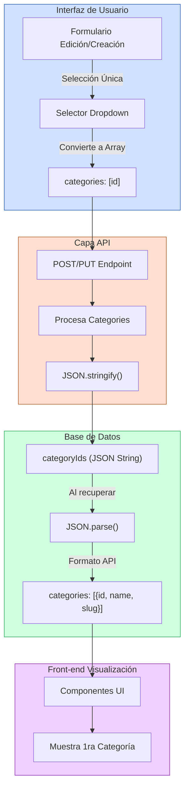

# Solución al Problema de Categorías en el Blog

## Diagrama de la Solución



## Problema Original

El sistema incluía dos componentes principales: un blog y un portfolio, ambos con sistema de taxonomías similares. Mientras el portfolio funcionaba correctamente, el blog presentaba problemas específicos:

1. **Categorías no guardadas**: Al crear o modificar posts, las categorías no se guardaban correctamente.
2. **Pseudónimos de autor no guardados**: Los nombres de autor personalizados tampoco se almacenaban adecuadamente.

## Análisis de la Causa

Después de analizar el código, se identificó que:

1. **Campo `categoryIds`**: Tanto en blog como portfolio, se utilizaba un campo JSON `categoryIds` para almacenar un array de IDs de categorías.

2. **Diferencia en implementación API**:
   - El portfolio procesaba correctamente este array, guardándolo como JSON en la base de datos.
   - El blog tenía errores en las rutas `app/api/blog/route.ts` y `app/api/blog/[id]/route.ts` que impedían el correcto procesamiento.

3. **Modelo conceptual inconsistente**: Mientras la UI permitía seleccionar múltiples categorías, el modelo subyacente estaba diseñado para una sola categoría principal.

## Solución Implementada

La solución consistió en dos partes clave:

### 1. Mejoras en el Backend (API)

Se corrigieron errores en los endpoints:

- **POST /api/blog**: Se mejoró el procesamiento del campo `categories` para convertirlo en JSON correctamente.
- **PUT /api/blog/[id]**: Se aseguró que las categorías proporcionadas se guardaran correctamente en el campo `categoryIds`.
- **GET /api/blog/[id]**: Se optimizó la recuperación y mapeo de categorías desde el `categoryIds` almacenado.

### 2. Actualización en la Interfaz de Usuario

Se modificaron varios componentes para reflejar el modelo de categoría única:

- **Formularios de Edición/Creación**: 
  - Se reemplazaron los checkboxes multi-selección por un selector dropdown que permite una sola categoría.
  - Se mantiene la estructura de array en el envío para compatibilidad con la API.

- **Páginas de Listado**:
  - Se actualizó la visualización para mostrar solo la primera categoría.

- **Páginas de Detalle**:
  - Se modificó la presentación para mostrar una única categoría vinculada.

## Archivos Actualizados

### API
- `app/api/blog/route.ts`
- `app/api/blog/[id]/route.ts`

### UI Administrador
- `app/(admin)/admin/blog/edit/[id]/page.tsx`
- `app/(admin)/admin/blog/new/page.tsx`
- `app/(admin)/admin/blog/page.tsx`
- `app/(admin)/admin/portfolio/edit/[id]/page.tsx`
- `app/(admin)/admin/portfolio/new/page.tsx`
- `app/(admin)/admin/portfolio/page.tsx`

### UI Público
- `app/(public)/blog/[slug]/page.tsx`
- `app/(public)/portfolio/[slug]/page.tsx`
- `app/(public)/portfolio/PortfolioListClient.tsx`
- `app/(public)/portfolio/search/SearchResultsClient.tsx`
- `app/(public)/portfolio/category/[slug]/CategoryProjectsClient.tsx`

### Documentación y Pruebas
- `docs/ui-category-updates.md`
- `test-blog-single-category.js`

## Detalles Técnicos de la Implementación

### Compatibilidad con API

Para mantener compatibilidad con el código existente, se conservó la estructura de datos pero con restricciones:

```typescript
// Formato de datos enviado desde el front-end
{
  // ... otros campos
  categories: [categoriaId], // Array con un solo elemento
}

// Almacenamiento en la base de datos
categoryIds: JSON.stringify([categoriaId]) // String JSON con array
```

### Transformación UI

La clave para el selector único fue la transformación entre el modelo de UI y el modelo de datos:

```typescript
// Transformación al seleccionar una categoría
onValueChange={(value) => {
  // Convierte el valor único a un array con un elemento
  field.onChange(value ? [value] : []);
}}

// Transformación al cargar un valor existente
value={field.value?.length > 0 ? field.value[0] : ""}
```

### Ejemplo de Query SQL Directa

Para mayor eficiencia y control, se utilizaron algunas queries SQL directas:

```typescript
// Actualización de post con categoría
await prisma.$executeRaw`
  UPDATE Post
  SET categoryIds = ${JSON.stringify([categoriaId])}
  WHERE id = ${postId}
`;
```

## Verificación de los Cambios

Se creó un script de prueba (`test-blog-single-category.js`) que:

1. Crea un post con una categoría seleccionada.
2. Verifica que se almacene correctamente como array JSON.
3. Recupera el post a través de la API para confirmar que la categoría se muestra correctamente.
4. Limpia los datos de prueba.

Para ejecutar este script:

```bash
node test-blog-single-category.js
```

## Consideraciones Futuras

Si en el futuro se requiere soporte real para múltiples categorías, se recomienda:

1. Migrar a una tabla de relación many-to-many entre Post y Category.
2. Actualizar la interfaz para permitir selección múltiple nuevamente.
3. Modificar los endpoints API para manejar esta relación más compleja.

Sin embargo, la solución actual de categoría única ofrece:
- Mayor simplicidad conceptual
- Mejor rendimiento en consultas
- Interfaz más clara para los usuarios finales

## Conclusión

Esta actualización resuelve los problemas identificados y armoniza el comportamiento del blog con el portfolio, manteniendo una experiencia de usuario coherente y un modelo de datos más limpio. Al estandarizar en un enfoque de categoría única, se simplifica tanto el UI como la lógica subyacente sin perder funcionalidad esencial.
